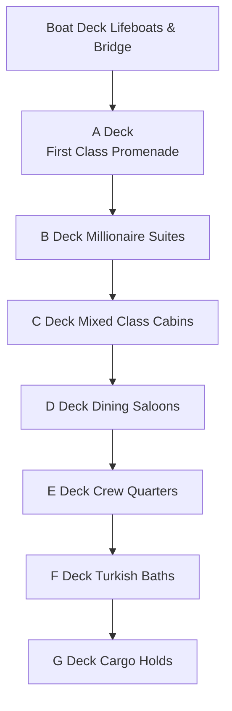
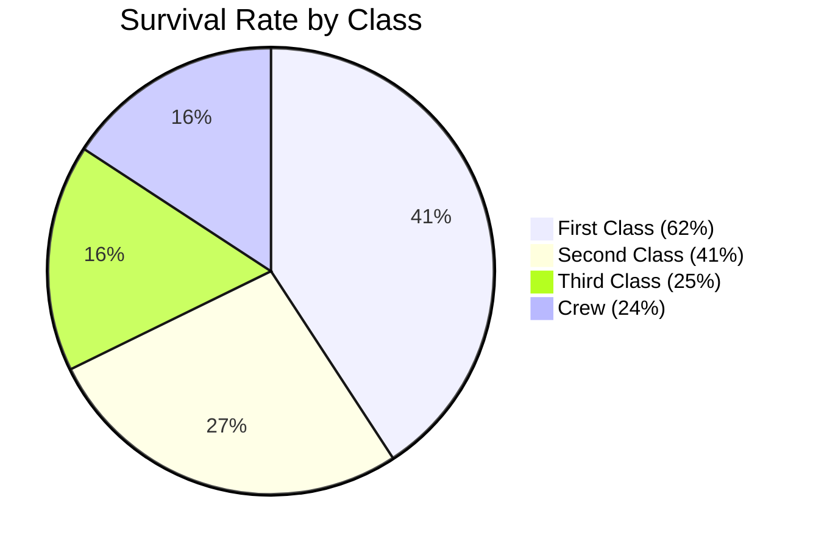
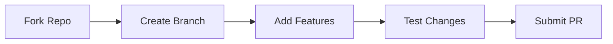

# 🚢 RMS Titanic Interactive Simulation


An immersive web-based simulation exploring the RMS Titanic's architecture, passenger stories, and historical events. Navigate through detailed deck plans, discover passenger biographies, and relive history in this interactive experience.

## ✨ Features

| Icon | Feature               | Description                                                                 |
|------|-----------------------|-----------------------------------------------------------------------------|
| 🗺️  | **Deck Exploration**  | Interactive SVG maps of all 8 decks with class-specific color coding        |
| 👥   | **Passenger Stories** | 100+ historically accurate passenger profiles with survival status          |
| 🔍  | **Room Inspection**   | Clickable rooms with descriptions, features, and historical context        |
| 📊  | **Demographics**      | Survival statistics visualized through interactive charts and diagrams      |
| 🕹️  | **Interactive Tools** | Zoom/pan controls, deck selector, and dynamic information panels           |
| 📚  | **Historical Data**   | 150+ historical notes and technical specifications                         |

## 🛠️ Installation

```bash
git clone https://github.com/awrsha/RMS-Titanic-Interactive-Simulation.git
cd RMS-Titanic-Interactive-Simulation
open RMS-Titanic-Interactive-Simulation.html
```

## 🚪 Deck Overview



## 👥 Passenger Demographics



| Class        | Total | Survived | Percentage |
|--------------|-------|----------|------------|
| First Class  | 325   | 202      | 62%        |
| Second Class | 285   | 118      | 41%        |
| Third Class  | 706   | 178      | 25%        |
| Crew         | 908   | 214      | 24%        |

## 🕰️ Historical Facts

- ⚓ Maiden Voyage: April 10, 1912 - April 15, 1912
- 📏 Dimensions: 269 meters (882 ft 9 in) long
- 💰 Ticket Costs: $4,350 (First Class) vs $35 (Third Class) in 1912 dollars
- 🚤 Lifeboats: 20 carried (capacity 1,178 vs 2,223 passengers)
- ⚡ Electricity: 59kW generating capacity (massive for 1912)

## 🎮 How to Interact

1. **Deck Selection**  
   Use the deck buttons to navigate between levels

2. **Room Inspection**  
   Click any room to see:
   - Passenger list with survival status
   - Historical context
   - Technical specifications

3. **Zoom Controls**  
   - [+] Zoom in for detail
   - [↺] Reset view
   - [-] Zoom out

4. **Passenger Filter**  
   Sort by:
   - Survival status
   - Gender
   - Class
   - Age

## 🤝 Contributing



Contributions welcome! Please follow standard GitHub workflow:
1. Fork the project
2. Create feature branch (`git checkout -b feature/AmazingFeature`)
3. Commit changes (`git commit -m 'Add amazing feature'`)
4. Push to branch (`git push origin feature/AmazingFeature`)
5. Open Pull Request

## 📜 License

📄 [Appache License](LICENSE)  
© 2025 RMS Titanic Interactive Simulation

## 🙏 Acknowledgments

- Titanic Historical Society for archival data
- Encyclopedia Titanica for passenger records
- National Geographic for technical schematics
- Library of Congress for historical photographs

---

⚓ **Explore history responsibly** - This project aims to honor the memory of all who sailed on Titanic's maiden voyage.
